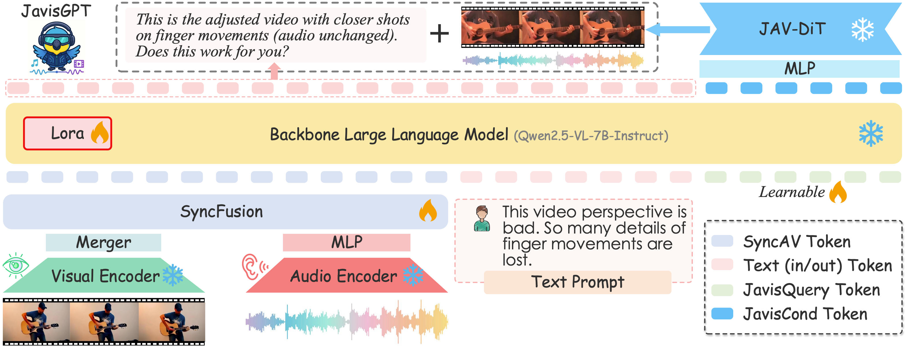

## <div align="center"> JavisGPT: A Unified Multi-modal LLM for Sounding-Video Comprehension and Generation</div>

<div align="center">

[[`HomePage`](https://javisverse.github.io/JavisGPT-page/)] 
[[`Paper`](https://openreview.net/forum?id=MZoOpD9NHV)] 

</div>


## TL;DR

We introduce **`JavisGPT`**, a multimodal LLM that can understand audiovisual inputs and simultaneously generate synchronized sounding videos in a unified model. 
We also curate the **`JavisInst-Omni`** dataset to facilitate instruction-tuning for comprehension and generation on sounding videos.





## Code
Stay Tuned.


## Citation

If you find JavisGPT is useful and use it in your project, please kindly cite:
```
@inproceedings{liu2025javisgpt,
    title={JavisGPT: A Unified Multi-modal LLM for Sounding-Video Comprehension and Generation},
    author={Kai Liu and Jungang Li and Yuchong Sun and Shengqiong Wu and jianzhang gao and Daoan Zhang and Wei Zhang and Sheng Jin and Sicheng Yu and Geng Zhan and Jiayi Ji and Fan Zhou and Liang Zheng and Shuicheng YAN and Hao Fei and Tat-Seng Chua},
    booktitle={The Thirty-ninth Annual Conference on Neural Information Processing Systems},
    year={2025},
}
```

